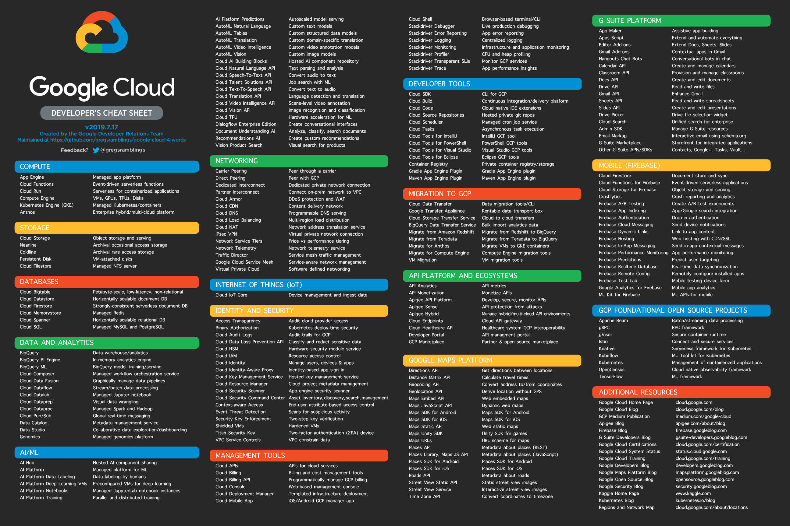

# The Google Cloud Developer's Cheat Sheet

\
White background:
[Poster PDF](Poster.pdf)
|
[Brochure PDF](Brochure.pdf)
|
[High-resolution PNG](Poster-hires.png)
|
[Medium-res PNG](Poster-medres.png)
|
[Low-res PNG](Poster-lowres.png)\
Dark background:
[Poster PDF](DarkPoster.pdf)
|
[Brochure PDF](DarkBrochure.pdf)
|
[High-resolution PNG](DarkPoster-hires.png)
|
[Medium-res PNG](DarkPoster-medres.png)
|
[Low-res PNG](DarkPoster-lowres.png)

Desktop Wallpapers: [16:9 (iMac, etc.)](Wallpaper-16-9.png) | [16:10 (Macbook Pro)](Wallpaper-16-10.png) | [4:3 (Older computers)](Wallpaper-4-3.png) | [3:2 (Pixelbook)](Wallpaper-3-2.png)

Text descriptions with links are below

Suggestions for better descriptions? Missing products? Pull requests are welcome on README.md (this file).

Feedback? [@aslamlatheef](https://twitter.com/deceptionistal)

----------------------------
# All Products
:link:-Product page
:page_facing_up:-Documentation

### Compute

* **App Engine**: Managed app platform [:link:](https://cloud.google.com/appengine/) [:page_facing_up:](https://cloud.google.com/appengine/docs/)
* **Cloud Functions**: Event-driven serverless functions [:link:](https://cloud.google.com/functions/) [:page_facing_up:](https://cloud.google.com/functions/docs/)
* **Cloud Run :new:**: Serverless for containerized applications [:link:](https://cloud.google.com/run/) [:page_facing_up:](https://cloud.google.com/run/docs/)
* **Compute Engine**: VMs, GPUs, TPUs, Disks [:link:](https://cloud.google.com/compute/) [:page_facing_up:](https://cloud.google.com/compute/docs/)
* **Kubernetes Engine (GKE)**: Managed Kubernetes/containers [:link:](https://cloud.google.com/kubernetes-engine/) [:page_facing_up:](https://cloud.google.com/kubernetes-engine/docs/)
* **Anthos :new:**: Enterprise hybrid/multi-cloud platform [:link:](https://cloud.google.com/anthos/) [:page_facing_up:](https://cloud.google.com/anthos/docs/)
   
### Storage
  
* **Cloud Storage**: Object storage and serving [:link:](https://cloud.google.com/storage/) [:page_facing_up:](https://cloud.google.com/storage/docs/)
* **Nearline**: Archival occasional access storage [:link:](https://cloud.google.com/storage/archival/) [:page_facing_up:](https://cloud.google.com/storage/docs/)
* **Coldline**: Archival rare access storage [:link:](https://cloud.google.com/storage/archival/) [:page_facing_up:](https://cloud.google.com/storage/docs/)
* **Persistent Disk**: VM-attached disks [:link:](https://cloud.google.com/persistent-disk/) [:page_facing_up:](https://cloud.google.com/compute/docs/disks/)
* **Cloud Filestore**: Managed NFS server [:link:](https://cloud.google.com/filestore/) [:page_facing_up:](https://cloud.google.com/filestore/docs/)
  
### Database 
  
* **Cloud Bigtable**: Petabyte-scale, low-latency, non-relational [:link:](https://cloud.google.com/bigtable/) [:page_facing_up:](https://cloud.google.com/bigtable/docs/)
* **Cloud Datastore**: Horizontally scalable document DB [:link:](https://cloud.google.com/datastore/) [:page_facing_up:](https://cloud.google.com/datastore/docs/)
* **Cloud Firestore**: Strongly-consistent serverless document DB [:link:](https://cloud.google.com/firestore/) [:page_facing_up:](https://cloud.google.com/firestore/docs/)
* **Cloud Memorystore**: Managed Redis [:link:](https://cloud.google.com/memorystore/) [:page_facing_up:](https://cloud.google.com/memorystore/docs/)
* **Cloud Spanner**: Horizontally scalable relational DB [:link:](https://cloud.google.com/spanner/) [:page_facing_up:](https://cloud.google.com/spanner/docs/)
* **Cloud SQL**: Managed MySQL and PostgreSQL [:link:](https://cloud.google.com/sql/) [:page_facing_up:](https://cloud.google.com/sql/docs/)
  
### Data and Analytics 
  
* **BigQuery**: Data warehouse/analytics [:link:](https://cloud.google.com/bigquery/) [:page_facing_up:](https://cloud.google.com/bigquery/docs/)
* **BigQuery BI Engine :new:**: In-memory analytics engine [:page_facing_up:](https://cloud.google.com/bi-engine/docs/)
* **BigQuery ML :new:**: BigQuery model training/serving [:page_facing_up:](https://cloud.google.com/bigquery-ml/docs/)
* **Cloud Composer**: Managed workflow orchestration service [:link:](https://cloud.google.com/composer/) [:page_facing_up:](https://cloud.google.com/composer/docs/)
* **Cloud Data Fusion :new:**: Graphically manage data pipelines [:link:](https://cloud.google.com/data-fusion/) [:page_facing_up:](https://cloud.google.com/data-fusion/docs/)
* **Cloud Dataflow**: Stream/batch data processing [:link:](https://cloud.google.com/dataflow/) [:page_facing_up:](https://cloud.google.com/dataflow/docs/)
* **Cloud Datalab**: Managed Jupyter notebook [:link:](https://cloud.google.com/datalab/) [:page_facing_up:](https://cloud.google.com/datalab/docs/)
* **Cloud Dataprep**: Visual data wrangling [:link:](https://cloud.google.com/dataprep/) [:page_facing_up:](https://cloud.google.com/dataprep/docs/)
* **Cloud Dataproc**: Managed Spark and Hadoop [:link:](https://cloud.google.com/dataproc/) [:page_facing_up:](https://cloud.google.com/dataproc/docs/)
* **Cloud Pub/Sub**: Global real-time messaging [:link:](https://cloud.google.com/pubsub/) [:page_facing_up:](https://cloud.google.com/pubsub/docs/)
* **Data Catalog :new:**: Metadata management service  [:link:](https://cloud.google.com/data-catalog/) [:page_facing_up:](https://cloud.google.com/data-catalog/docs/)
* **Data Studio**: Collaborative data exploration/dashboarding [:link:](https://datastudio.google.com/overview) [:page_facing_up:](https://datastudio.google.com/overviewdocs/)
* **Genomics**: Managed genomics platform [:link:](https://cloud.google.com/genomics/) [:page_facing_up:](https://cloud.google.com/genomics/docs/)
  
### AI/ML 

* **AI Hub :new:**: Hosted AI component sharing [:link:](https://cloud.google.com/ai-hub/) [:page_facing_up:](https://cloud.google.com/ai-hub/docs/)
* **AI Platform**: Managed platform for ML [:link:](https://cloud.google.com/ai-platform/) [:page_facing_up:](https://cloud.google.com/ml-engine/docs/)
* **AI Platform Data Labeling :new:**: Data labeling by humans [:page_facing_up:](https://cloud.google.com/data-labeling/docs/)
* **AI Platform Deep Learning VMs**: Preconfigured VMs for deep learning [:link:](https://cloud.google.com/deep-learning-vm/) [:page_facing_up:](https://cloud.google.com/deep-learning-vm/docs/)
* **AI Platform Notebooks :new:**: Managed JupyterLab notebook instances [:link:](https://cloud.google.com/ai-platform-notebooks/)[:page_facing_up:](https://cloud.google.com/ml-engine/docs/notebooks/)
* **AI Platform Training :new:**: Parallel and distributed training [:page_facing_up:](https://cloud.google.com/ml-engine/docs/tensorflow/training-overview)
* **AI Platform Predictions :new:**: Autoscaled model serving [:page_facing_up:](https://cloud.google.com/ml-engine/docs/tensorflow/prediction-overview)
* **AutoML Natural Language**: Custom text models [:page_facing_up:](https://cloud.google.com/natural-language/automl/docs/)
* **AutoML Tables :new:**: Custom structured data models [:link:](https://cloud.google.com/automl-tables/) [:page_facing_up:](https://cloud.google.com/automl-tables/docs/)
* **AutoML Translation**: Custom domain-specific translation [:link:](https://cloud.google.com/translate/) [:page_facing_up:](https://cloud.google.com/translate/docs/)
* **AutoML Video Intelligence :new:**: Custom video annotation models [:link:](https://cloud.google.com/video-intelligence/) [:page_facing_up:](https://cloud.google.com/video-intelligence/automl/docs/)
* **AutoML Vision**: Custom image models [:link:](https://cloud.google.com/automl/) [:page_facing_up:](https://cloud.google.com/automl/docs/)
* **Cloud AI Building Blocks :new:**: Hosted AI component repository [:link:](https://cloud.google.com/ai-hub/) [:page_facing_up:](https://cloud.google.com/ai-hub/docs/)
* **Cloud Natural Language API**: Text parsing and analysis [:link:](https://cloud.google.com/natural-language/) [:page_facing_up:](https://cloud.google.com/natural-language/docs/)
* **Cloud Speech-To-Text API**: Convert audio to text [:link:](https://cloud.google.com/speech/) [:page_facing_up:](https://cloud.google.com/speech/docs/)
* **Cloud Talent Solutions API**: Job search with ML [:link:](https://cloud.google.com/job-discovery/) [:page_facing_up:](https://cloud.google.com/job-discovery/docs/)
* **Cloud Text-To-Speech API**: Convert text to audio [:link:](https://cloud.google.com/text-to-speech/) [:page_facing_up:](https://cloud.google.com/text-to-speech/docs/)
* **Cloud Translation API**: Language detection and translation [:link:](https://cloud.google.com/translate/) [:page_facing_up:](https://cloud.google.com/translate/docs/)
* **Cloud Video Intelligence API**: Scene-level video annotation [:link:](https://cloud.google.com/video-intelligence/) [:page_facing_up:](https://cloud.google.com/video-intelligence/docs/)
* **Cloud Vision API**: Image recognition and classification [:link:](https://cloud.google.com/vision/) [:page_facing_up:](https://cloud.google.com/vision/docs/)
* **Cloud TPU**: Hardware acceleration for ML [:link:](https://cloud.google.com/tpu/) [:page_facing_up:](https://cloud.google.com/tpu/docs/)
* **Dialogflow Enterprise Edition**: Create conversational interfaces [:link:](https://cloud.google.com/dialogflow-enterprise/) [:page_facing_up:](https://cloud.google.com/dialogflow-enterprise/docs/)
* **Document Understanding AI :new:**: Analyze, classify, search documents [:link:](https://cloud.google.com/solutions/document-understanding/) [:page_facing_up:](https://cloud.google.com/document-understanding/docs/)
* **Recommendations AI :new:**: Create custom recommendations [:link:](https://cloud.google.com/recommendations/) [:page_facing_up:](https://cloud.google.com/recommendations-ai/docs/)
* **Vision Product Search :new:**: Visual search for products [:page_facing_up:](https://cloud.google.com/vision/product-search/docs/)

### Networking 
  
* **Carrier Peering**: Peer through a carrier [:page_facing_up:](https://cloud.google.com/interconnect/docs/how-to/carrier-peering)
* **Direct Peering**: Peer with GCP [:page_facing_up:](https://cloud.google.com/interconnect/docs/how-to/direct-peering)
* **Dedicated Interconnect**: Dedicated private network connection [:page_facing_up:](https://cloud.google.com/interconnect/docs/details/dedicated)
* **Partner Interconnect**: Connect on-prem network to VPC [:page_facing_up:](https://cloud.google.com/interconnect/docs/concepts/partner-overview)
* **Cloud Armor**: DDoS protection and WAF [:link:](https://cloud.google.com/armor/) [:page_facing_up:](https://cloud.google.com/armor/docs/)
* **Cloud CDN**: Content delivery network [:link:](https://cloud.google.com/cdn/) [:page_facing_up:](https://cloud.google.com/cdn/docs/)
* **Cloud DNS**: Programmable DNS serving [:link:](https://cloud.google.com/dns/) [:page_facing_up:](https://cloud.google.com/dns/docs/)
* **Cloud Load Balancing**: Multi-region load distribution [:link:](https://cloud.google.com/load-balancing/) [:page_facing_up:](https://cloud.google.com/load-balancing/docs/)
* **Cloud NAT**: Network address translation service [:page_facing_up:](https://cloud.google.com/nat/docs/overview/)
* **Cloud Router :new:**: VPC/on-prem network route exchange (BGP) [:page_facing_up:](https://cloud.google.com/router/docs/)
* **IPsec VPN**: Virtual private network connection [:page_facing_up:](https://cloud.google.com/compute/docs/vpn/overview)
* **Network Service Tiers**: Price vs performance tiering [:link:](https://cloud.google.com/network-tiers/) [:page_facing_up:](https://cloud.google.com/network-tiers/docs/)
* **Network Telemetry**: Network telemetry service [:link:](https://cloud.google.com/network-telemetry/) [:page_facing_up:](https://cloud.google.com/vpc/docs/using-flow-logs/)
* **Traffic Director :new:**: Service mesh traffic management [:link:](https://cloud.google.com/traffic-director/) [:page_facing_up:](https://cloud.google.com/traffic-director/docs/)
* **Google Cloud Service Mesh :new:**: Service-aware network management [:link:](https://cloud.google.com/service-mesh/) [:page_facing_up:](https://cloud.google.com/trace/docs/)
* **Virtual Private Cloud**: Software defined networking [:link:](https://cloud.google.com/vpc/) [:page_facing_up:](https://cloud.google.com/vpc/docs/)
  
### Internet of Things (IoT) 
  
* **Cloud IoT Core**: Device management and ingest data [:link:](https://cloud.google.com/iot-core/) [:page_facing_up:](https://cloud.google.com/iot-core/docs/)
  
### Identity and Security
  
* **Access Transparency**: Audit cloud provider access [:link:](https://cloud.google.com/access-transparency/) [:page_facing_up:](https://cloud.google.com/logging/docs/audit/access-transparency-overview/)
* **Binary Authorization**: Kubernetes deploy-time security [:link:](https://cloud.google.com/binary-authorization/) [:page_facing_up:](https://cloud.google.com/binary-authorization/docs/)
* **Cloud Audit Logs :new:**: Audit trails for GCP [:link:](https://cloud.google.com/audit-logs/) [:page_facing_up:](https://cloud.google.com/logging/docs/audit/)
* **Cloud Data Loss Prevention API**: Classify and redact sensitive data [:link:](https://cloud.google.com/dlp/) [:page_facing_up:](https://cloud.google.com/dlp/docs/)
* **Cloud HSM**: Hardware security module service [:link:](https://cloud.google.com/hsm/) [:page_facing_up:](https://cloud.google.com/kms/docs/hsm/)
* **Cloud IAM**: Resource access control [:link:](https://cloud.google.com/iam/) [:page_facing_up:](https://cloud.google.com/iam/docs/)
* **Cloud Identity**: Manage users, devices & apps [:link:](https://cloud.google.com/identity/) [:page_facing_up:](https://cloud.google.com/identity/solutions/overview/)
* **Cloud Identity-Aware Proxy**: Identity-based app sign in [:link:](https://cloud.google.com/iap/) [:page_facing_up:](https://cloud.google.com/iap/docs/)
* **Cloud Key Management Service**: Hosted key management service [:link:](https://cloud.google.com/kms/) [:page_facing_up:](https://cloud.google.com/kms/docs/)
* **Cloud Resource Manager**: Cloud project metadata management [:link:](https://cloud.google.com/resource-manager/) [:page_facing_up:](https://cloud.google.com/resource-manager/docs/)
* **Cloud Security Scanner**: App engine security scanner [:link:](https://cloud.google.com/security-scanner/) [:page_facing_up:](https://cloud.google.com/security-scanner/docs/)
* **Cloud Security Command Center**: Asset inventory, discovery, search, management [:link:](https://cloud.google.com/security-command-center/) [:page_facing_up:](https://cloud.google.com/security-command-center/docs/)
* **Context-aware Access :new:**: End-user attribute-based access control [:link:](https://cloud.google.com/context-aware-access/) [:page_facing_up:](https://cloud.google.com/iap/docs/cloud-iap-context-aware-access-howto/)
* **Event Threat Detection :new:**: Scans for suspicious activity [:link:](https://cloud.google.com/event-threat-detection/) 
* **Managed Service for Microsoft Active Directory :new:**: Managed Microsoft Active Directory  [:link:](https://cloud.google.com/managed-microsoft-ad/) [:page_facing_up:](https://cloud.google.com/managed-microsoft-ad/docs/)
* **Security Key Enforcement**: Two-step key verification [:link:](https://cloud.google.com/security-key/)
* **Shielded VMs**: Hardened VMs [:link:](https://cloud.google.com/shielded-vm/) [:page_facing_up:](https://cloud.google.com/security/shielded-cloud/shielded-vm/)
* **Titan Security Key**: Two-factor authentication (2FA) device [:link:](https://cloud.google.com/titan-security-key/)
* **VPC Service Controls :new:**: VPC constrain data [:link:](https://cloud.google.com/vpc-service-controls/) [:page_facing_up:](https://cloud.google.com/vpc-service-controls/docs/)
  
### Management Tools 
  
* **Cloud APIs**: APIs for cloud services [:link:](https://cloud.google.com/apis/) [:page_facing_up:](https://cloud.google.com/apis/docs/)
* **Cloud Billing**: Billing and cost management tools [:link:](https://cloud.google.com/billing/docs/) [:page_facing_up:](https://cloud.google.com/billing/docs/docs/)
* **Cloud Billing API**: Programmatically manage GCP billing [:page_facing_up:](https://cloud.google.com/billing/docs/)
* **Cloud Console**: Web-based management console [:link:](https://cloud.google.com/cloud-console/)
* **Cloud Deployment Manager**: Templated infrastructure deployment [:link:](https://cloud.google.com/deployment-manager/) [:page_facing_up:](https://cloud.google.com/deployment-manager/docs/)
* **Cloud Mobile App**: iOS/Android GCP manager app [:link:](https://cloud.google.com/console-app/)
* **Cloud Shell**: Browser-based terminal/CLI [:link:](https://cloud.google.com/shell/) [:page_facing_up:](https://cloud.google.com/shell/docs/)
* **Stackdriver Debugger**: Live production debugging [:link:](https://cloud.google.com/debugger/) [:page_facing_up:](https://cloud.google.com/debugger/docs/)
* **Stackdriver Error Reporting**: App error reporting [:link:](https://cloud.google.com/error-reporting/) [:page_facing_up:](https://cloud.google.com/error-reporting/docs/)
* **Stackdriver Logging**: Centralized logging [:link:](https://cloud.google.com/logging/) [:page_facing_up:](https://cloud.google.com/logging/docs/)
* **Stackdriver Monitoring**: Infrastructure and application monitoring [:link:](https://cloud.google.com/monitoring/) [:page_facing_up:](https://cloud.google.com/monitoring/docs/)
* **Stackdriver Profiler**: CPU and heap profiling [:link:](https://cloud.google.com/profiler/) [:page_facing_up:](https://cloud.google.com/profiler/docs/)
* **Stackdriver Transparent SLIs**: Monitor GCP services [:link:](https://cloud.google.com/transparent-sli/) [:page_facing_up:](https://cloud.google.com/apis/docs/monitoring/)
* **Stackdriver Trace**: App performance insights [:link:](https://cloud.google.com/trace/) [:page_facing_up:](https://cloud.google.com/trace/docs/)  

### Developer Tools  
  
* **Cloud SDK**: CLI for GCP [:link:](https://cloud.google.com/sdk/) [:page_facing_up:](https://cloud.google.com/sdk/docs/)
* **Cloud Build**: Continuous integration/delivery platform [:link:](https://cloud.google.com/cloud-build/) [:page_facing_up:](https://cloud.google.com/cloud-build/docs/)
* **Cloud Code :new:**: Cloud native IDE extensions [:link:](https://cloud.google.com/code/) [:page_facing_up:](https://cloud.google.com/code/docs/)
* **Cloud Source Repositories**: Hosted private git repos [:link:](https://cloud.google.com/source-repositories/) [:page_facing_up:](https://cloud.google.com/source-repositories/docs/)
* **Cloud Scheduler**: Managed cron job service [:link:](https://cloud.google.com/scheduler/) [:page_facing_up:](https://cloud.google.com/scheduler/docs/)
* **Cloud Tasks :new:**: Asynchronous task execution [:link:](https://cloud.google.com/tasks/) [:page_facing_up:](https://cloud.google.com/tasks/docs/)
* **Cloud Tools for IntelliJ**: IntelliJ GCP tools [:link:](https://cloud.google.com/intellij/)
* **Cloud Tools for PowerShell**: PowerShell GCP tools [:link:](https://cloud.google.com/powershell/)
* **Cloud Tools for Visual Studio**: Visual Studio GCP tools [:link:](https://cloud.google.com/visual-studio/)
* **Cloud Tools for Eclipse**: Eclipse GCP tools [:link:](https://cloud.google.com/eclipse/docs/)
* **Container Registry**: Private container registry/storage [:link:](https://cloud.google.com/container-registry/) [:page_facing_up:](https://cloud.google.com/container-registry/docs/)
* **Gradle App Engine Plugin**: Gradle App Engine plugin [:link:](https://github.com/GoogleCloudPlatform/app-gradle-plugin)
* **Maven App Engine Plugin**: Maven App Engine plugin [:link:](https://github.com/GoogleCloudPlatform/app-maven-plugin)
  
### Migration to GCP  
  
* **Cloud Data Transfer**: Data migration tools/CLI [:link:](https://cloud.google.com/products/data-transfer/)
* **Google Transfer Appliance**: Rentable data transport box [:link:](https://cloud.google.com/transfer-appliance/) [:page_facing_up:](https://cloud.google.com/transfer-appliance/docs/)
* **Cloud Storage Transfer Service**: Cloud to cloud transfers [:page_facing_up:](https://cloud.google.com/storage/transfer/)
* **BigQuery Data Transfer Service**: Bulk import analytics data [:link:](https://cloud.google.com/bigquery/transfer/) [:page_facing_up:](https://cloud.google.com/bigquery/transfer/docs/)
* **Migrate from Amazon Redshift :new:**: Migrate from Redshift to BigQuery [:link:](https://cloud.google.com/bigquery/docs/redshift-migration) 
* **Migrate from Teradata :new:**: Migrate from Teradata to BigQuery [:link:](https://cloud.google.com/solutions/migration/td2bq/td-bq-migration-overview) 
* **Migrate for Anthos :new:**: Migrate VMs to GKE containers [:link:](https://cloud.google.com/migrate/anthos/) [:page_facing_up:](https://cloud.google.com/migrate/anthos/docs/getting-started)
* **Migrate for Compute Engine**: Compute Engine migration tools [:link:](https://cloud.google.com/migrate/compute-engine/) [:page_facing_up:](https://cloud.google.com/velostrata/docs/)
* **VM Migration**: VM migration tools [:link:](https://cloud.google.com/vm-migrate/) 

### API Platform and Ecosystems  
  
* **API Analytics**: API metrics [:link:](https://cloud.google.com/api-analytics/)
* **API Monetization**: Monetize APIs [:link:](https://cloud.google.com/api-monetization/)
* **Apigee API Platform**: Develop, secure, monitor APIs [:link:](https://cloud.google.com/apigee-api-management/)
* **Apigee Sense**: API protection from attacks [:link:](https://cloud.google.com/apigee-sense/)
* **Apigee Hybrid :new:**: Manage hybrid/multi-cloud API environments [:link:](https://cloud.google.com/apigee/api-management/hybrid/)[:page_facing_up:](https://docs.apigee.com/hybrid/beta2)
* **Cloud Endpoints**: Cloud API gateway [:link:](https://cloud.google.com/endpoints/)
* **Cloud Healthcare API**: Healthcare system GCP interoperability [:link:](https://cloud.google.com/healthcare-api/)
* **Developer Portal**: API management portal [:link:](https://cloud.google.com/developer-portal/)
* **GCP Marketplace**: Partner & open source marketplace [:link:](https://cloud.google.com/marketplace/)
  
### Google Maps Platform  
  
* **Directions API**: Get directions between locations [:link:](https://developers.google.com/maps/documentation/directions/)
* **Distance Matrix API**: Calculate travel times [:link:](https://developers.google.com/maps/documentation/distance-matrix/intro)
* **Geocoding API**: Convert address to/from coordinates [:link:](https://developers.google.com/maps/documentation/geocoding/)
* **Geolocation API**: Derive location without GPS [:link:](https://developers.google.com/maps/documentation/geolocation/)
* **Maps Embed API**: Web embedded maps [:link:](https://developers.google.com/maps/documentation/embed/)
* **Maps JavaScript API**: Dynamic web maps [:link:](https://developers.google.com/maps/documentation/javascript/)
* **Maps SDK for Android**: Maps SDK for Android [:link:](https://developers.google.com/maps/documentation/android-sdk/)
* **Maps SDK for iOS**: Maps SDK for iOS [:link:](https://developers.google.com/maps/documentation/ios-sdk/)
* **Maps Static API**: Web static maps [:link:](https://developers.google.com/maps/documentation/maps-static/)
* **Maps Unity SDK**: Unity SDK for games [:link:](https://cloud.google.com/maps-platform/gaming/)
* **Maps URLs**: URL scheme for maps [:link:](https://developers.google.com/maps/documentation/urls/)
* **Places API**: Metadata about places (REST) [:link:](https://developers.google.com/places/web-service/)
* **Places Library, Maps JS API**: Metadata about places (JavaScript) [:link:](https://developers.google.com/maps/documentation/javascript/places)
* **Places SDK for Android**: Places SDK for Android [:link:](https://developers.google.com/places/android-sdk/)
* **Places SDK for iOS**: Places SDK for iOS [:link:](https://developers.google.com/places/ios-sdk/)
* **Roads API**: Metadata about roads [:link:](https://developers.google.com/maps/documentation/roads/)
* **Street View Static API**: Static street view images [:link:](https://developers.google.com/maps/documentation/streetview/)
* **Street View Service**: Interactive street view images" [:link:](https://developers.google.com/maps/documentation/javascript/streetview/)
* **Time Zone API**: Convert coordinates to timezone [:link:](https://developers.google.com/maps/documentation/timezone/)
  
### G Suite Platform  
  
* **App Maker**: Assistive app building [:link:](https://developers.google.com/appmaker/)
* **Apps Script**: Extend and automate everything [:link:](https://developers.google.com/apps-script/)
* **Editor Add-ons**: Extend Docs, Sheets, Slides [:link:](https://developers.google.com/gsuite/add-ons/overview)
* **Gmail Add-ons**: Contextual apps in Gmail [:link:](https://developers.google.com/gmail/add-ons/)
* **Hangouts Chat Bots**: Conversational bots in chat [:link:](https://developers.google.com/hangouts/chat/)
* **Calendar API**: Create and manage calendars [:link:](https://developers.google.com/calendar/)
* **Classroom API**: Provision and manage classrooms [:link:](https://developers.google.com/classroom)
* **Docs API**: Create and edit documents [:link:](https://developers.google.com/docs/api/)
* **Drive API**: Read and write files [:link:](https://developers.google.com/drive/)
* **Gmail API**: Enhance Gmail [:link:](https://developers.google.com/gmail/)
* **Sheets API**: Read and write spreadsheets [:link:](https://developers.google.com/sheets/api/)
* **Slides API**: Create and edit presentations [:link:](https://developers.google.com/slides/)
* **Drive Picker**: Drive file selection widget [:link:](https://developers.google.com/picker/)
* **Cloud Search**: Unified search for enterprise [:link:](https://developers.google.com/cloud-search/docs/guides/)
* **Admin SDK**: Manage G Suite resources [:link:](https://developers.google.com/admin-sdk)
* **Email Markup**: Interactive email using schema.org [:link:](https://developers.google.com/gmail/markup/)
* **G Suite Marketplace**: Storefront for integrated applications [:link:](https://developers.google.com/gsuite/marketplace/)
* **Other G Suite APIs/SDKs**: Contacts, Google+, Tasks, Vault... [:link:](https://developers.google.com/gsuite/products)
  
### Mobile (Firebase)  
  
* **Cloud Firestore**: Document store and sync [:link:](https://firebase.google.com/products/firestore/)
* **Cloud Functions for Firebase**: Event-driven serverless applications [:link:](https://firebase.google.com/products/functions/)
* **Cloud Storage for Firebase**: Object storage and serving [:link:](https://firebase.google.com/products/storage/)
* **Crashlytics**: Crash reporting and analytics [:link:](https://fabric.io/kits/android/crashlytics/summary)
* **Firebase A/B Testing**: Create A/B test experiments [:link:](https://firebase.google.com/products/ab-testing/)
* **Firebase App Indexing**: App/Google search integration [:link:](https://firebase.google.com/products/app-indexing/)
* **Firebase Authentication**: Drop-in authentication [:link:](https://firebase.google.com/products/auth/)
* **Firebase Cloud Messaging**: Send device notifications [:link:](https://firebase.google.com/products/cloud-messaging/)
* **Firebase Dynamic Links**: Link to app content [:link:](https://firebase.google.com/products/dynamic-links/)
* **Firebase Hosting**: Web hosting with CDN/SSL [:link:](https://firebase.google.com/products/hosting/)
* **Firebase In-App Messaging**: Send  in-app contextual messages [:link:](https://firebase.google.com/products/in-app-messaging/)
* **Firebase Performance Monitoring**: App performance monitoring [:link:](https://firebase.google.com/products/performance/)
* **Firebase Predictions**: Predict user targeting [:link:](https://firebase.google.com/products/predictions/)
* **Firebase Realtime Database**: Real-time data synchronization [:link:](https://firebase.google.com/products/realtime-database/)
* **Firebase Remote Config**: Remotely configure installed apps [:link:](https://firebase.google.com/docs/remote-config/)
* **Firebase Test Lab**: Mobile testing device farm [:link:](https://firebase.google.com/docs/test-lab/)
* **Google Analytics for Firebase**: Mobile app analytics [:link:](https://firebase.google.com/products/analytics/)
* **ML Kit for Firebase**: ML APIs for mobile [:link:](https://firebase.google.com/products/ml-kit/)
  
### GCP Foundational Open Source Projects
  
* **Apache Beam**: Batch/streaming data processing [:link:](https://beam.apache.org/)
* **gRPC**: RPC framework [:link:](https://grpc.io/)
* **gVisor**: Secure container runtime [:link:](https://github.com/google/gvisor)
* **Istio**: Connect and secure services [:link:](https://istio.io/)
* **Knative**: Serverless framework for Kubernetes [:link:](https://github.com/knative)
* **Kubeflow**: ML toolkit for Kubernetes [:link:](https://www.kubeflow.org/)
* **Kubernetes**: Management of containerized applications [:link:](https://kubernetes.io/)
* **OpenCensus**: Cloud native observability framework [:link:](https://opencensus.io/)
* **TensorFlow**: ML framework [:link:](https://www.tensorflow.org/)

### Additional Resources

* **Google Cloud Home Page**: [:link:](https://cloud.google.com)
* **Google Cloud Blog**: [:link:](https://cloud.google.com/blog)
* **GCP Medium Publication**: [:link:](https://medium.com/google-cloud)
* **Apigee Blog**: [:link:](https://apigee.com/about/blog)
* **Firebase Blog**: [:link:](https://firebase.googleblog.com)
* **G Suite Developers Blog**: [:link:](https://gsuite-developers.googleblog.com)
* **Google Cloud Certifications**: [:link:](https://cloud.google.com/certification)
* **Google Cloud System Status**: [:link:](https://status.cloud.google.com)
* **Google Cloud Training**: [:link:](https://cloud.google.com/training)
* **Google Developers Blog**: [:link:](https://developers.googleblog.com) 
* **Google Maps Platform Blog**: [:link:](https://mapsplatform.googleblog.com)
* **Google Open Source Blog**: [:link:](https://opensource.googleblog.com)
* **Google Security Blog**: [:link:](https://security.googleblog.com)
* **Kaggle Home Page**: [:link:](https://www.kaggle.com) 
* **Kubernetes Blog**: [:link:](https://kubernetes.io/blog)
* **Regions and Network Map**: [:link:](https://cloud.google.com/about/locations)

----------------------------
### Everything below is not included in the PDFs/PNGs due to space limitations

----------------------------

### Additional Resources

* **Google Cloud Solutions Library**:[:link:](https://cloud.google.com/solutions/)
* **Google Cloud Support Hub**:[:link:](https://cloud.google.com/support-hub/)
* **GCP Pricing**: [:link:](https://cloud.google.com/pricing/)
* **GCP Pricing Calculator**: [:link:](https://cloud.google.com/products/calculator/)
* **Qwiklabs Home Page**:[:link:](https://www.qwiklabs.com/home?locale=en)
* **Codelabs Home Page**:[:link:](https://codelabs.developers.google.com/)
* **YouTube Channels**:
  * **Google Cloud YouTube Channel**:[:link:](https://www.youtube.com/channel/UCTMRxtyHoE3LPcrl-kT4AQQ)
  * **GCP YouTube Channel**:[:link:](https://www.youtube.com/user/googlecloudplatform)
  * **Google Developer's YouTube Channel**:[:link:](https://www.youtube.com/user/GoogleDevelopers)
  * **Firebase YouTube Channel**:[:link:](https://www.youtube.com/user/Firebase)
* **Podcasts**:
  * **GCP Podcast**:[:link:](https://gcppodcast.com/)
  * **Kubernetes Podcast**:[:link:](https://kubernetespodcast.com/)
* **Reddit**:
  * **/r/googlecloud**: [:link:](https://www.reddit.com/r/googlecloud/)
  * **/r/AppEngine**: [:link:](https://www.reddit.com/r/AppEngine/)
  * **/r/bigquery**: [:link:](https://www.reddit.com/r/bigquery/)
  * **/r/dataflow**: [:link:](https://www.reddit.com/r/dataflow/)
  * **/r/firebase**: [:link:](https://www.reddit.com/r/firebase/)

### Platform Comparisons

* **Google Cloud Platform for AWS Professionals**:[:page_facing_up:](https://cloud.google.com/docs/compare/aws/)
* **Google Cloud Platform for Azure Professionals**:[:page_facing_up:](https://cloud.google.com/docs/compare/azure/)
* **Google Cloud Platform for Data Center Professionals**:[:page_facing_up:](https://cloud.google.com/docs/compare/data-centers/)
* **Google Cloud Platform for OpenStack Users**:[:page_facing_up:](https://cloud.google.com/docs/compare/openstack/)

### Language Specific Documentation

* **Java**:[:page_facing_up:](https://cloud.google.com/java/docs/)
* **Node.js**:[:page_facing_up:](https://cloud.google.com/nodejs/docs/)
* **Python**:[:page_facing_up:](https://cloud.google.com/python/docs/)
* **Go**:[:page_facing_up:](https://cloud.google.com/go/docs/)
* **Ruby**:[:page_facing_up:](https://cloud.google.com/ruby/docs/)
* **PHP**:[:page_facing_up:](https://cloud.google.com/php/docs/)
* **.NET/C#**:[:page_facing_up:](https://cloud.google.com/dotnet/docs/)

## BILLING >>>> Storing on BIGQUERY

You can capture and save your date on S3 and also Bigquery where you can also do some analytics if you want.

### CAPTURE BILLING DATA FROM BIGQUERY and Few more examples for Billing Report.
    SELECT *  
    FROM `cloud-training-prod-bucket.arch_infra.billing_data`

### Highest cost First 
    SELECT *  
    FROM `cloud-training-prod-bucket.arch_infra.billing_data`
    ORDER BY cost DESC
    
### Specific COST 

     SELECT product, resource_type, start_time, end_time,  
     cost, project_id, project_name, project_labels_key, currency, currency_conversion_rate,
     usage_amount, usage_unit
     FROM `cloud-training-prod-bucket.arch_infra.billing_data`
     WHERE (cost > 3)  

note here "3" is cost

### Next let’s find which product had the highest total number of records:

    SELECT product, COUNT(*)
    FROM `cloud-training-prod-bucket.arch_infra.billing_data`
    GROUP BY product
    LIMIT 200

###  let’s see which product most frequently cost more than a dollar:

    SELECT product, cost, COUNT(*)
    FROM `cloud-training-prod-bucket.arch_infra.billing_data`
    WHERE (cost > 1)
    GROUP BY cost, product
    LIMIT 200
    
## CLOUD STORAGE  >>>>>>>>>>>>>>>>>>>
### Assiging Access

### Assign IAM roles to buckets:

        gsutil iam ch user:(user_email):(role1,role2) gs://(BUCKET)

### Remove IAM role from bucket:

        gsutil iam ch -d user:(user_email):(role1,role2) gs://(BUCKET)

### Remove all roles from bucket for given user:

        gsutil iam ch -d user:(user_email) gs://(BUCKET)

### Assign ACL roles to buckets and objects:

        gsutil acl ch -u (user_email):(O/R/W) gs://(BUCKET)

### Delete all ACLs:

        gsutil acl ch -d (user_email) gs://(BUCKET)

### Signed URLs

Create service account with key
        
        Upload to cloud shell (or add to current CLI environment)
        gsutil signurl -d (time_period (10m)) (keyfile.json) gs://(BUCKET)/(object)

### Check current versioning policy:

        gsutil versioning get gs://&lt;BUCKET&gt;

### Enable Object Versioning:

        gsutil versioning set on gs://&lt;BUCKET&gt;

### Check full object details in bucket:

        gsutil ls -a gs://&lt;BUCKET&gt;

### Download current lifecycle policy to local machine to edit:

        gsutil lifecycle get gs://&lt;BUCKET&gt; > filename.json

### Set new lifecycle policy after making above edits:

        gsutil lifecycle set filename.json gs://&lt;BUCKET&gt;

## DISK MANAGEMENT >>>>>>>>>>>

### Create disk:

    gcloud compute disks create &lt;DISK_NAME&gt; --type=&lt;DISK_TYPE&gt; --size=&lt;SIZE&gt; --zone=&lt;ZONE&gt;

### Resize disk:

    gcloud compute disks resize &lt;disk_name&gt; --size=&lt;size&gt; --zone=&lt;zone&gt;

### Attach disk:

    gcloud compute instances attach-disk &lt;instance&gt; --disk=&lt;disk_name&gt; --zone=&lt;zone&gt;

## Formatting and Mounting DISK for LINUX in GCP >>>>>>
### View available disks:

    sudo lsblk
### Format attached disk:

    sudo mkfs.ext4 -m 0 -F -E lazy_itable_init=0,lazy_journal_init=0,discard /dev/sdb
### Create mount directory:

    sudo mkdir -p /mnt/disks/disk2
### Mount disk:

    sudo mount -o discard,defaults /dev/sdb /mnt/disks/disk2

### Set read/write permissions:

    sudo chmod a+w /mnt/disks/
    Resize existing Linux disk
    
### Identify the disk to resize:

    sudo lsblk

### Resize (grow) the partition:

    sudo growpart /dev/sda 1

### Extend file system to use added space:

    sudo resize2fs /dev/sda1

### Verify file system is resized:

    df -h 

## VIRTUAL MACHINE IMAGE MANAGEMENT ->>>>>>>>>
### Create image via command line:

    gcloud compute images create &lt;image_name&gt; --source-disk &lt;disk_name&gt; --source-disk-zone &lt;zone&gt; --family &lt;image_family&gt;

### View image family info:

    gcloud compute images describe-from-family &lt;image_family&gt;

#### Deprecate/set active image version:

    gcloud compute images deprecate &lt;image_name&gt; --state &lt;STATE&gt;

### Delete image:

  gcloud compute images delete &lt;image_name&gt;

## STACK DRIVER >>>>>>>>>>>>>>>>>>>>
